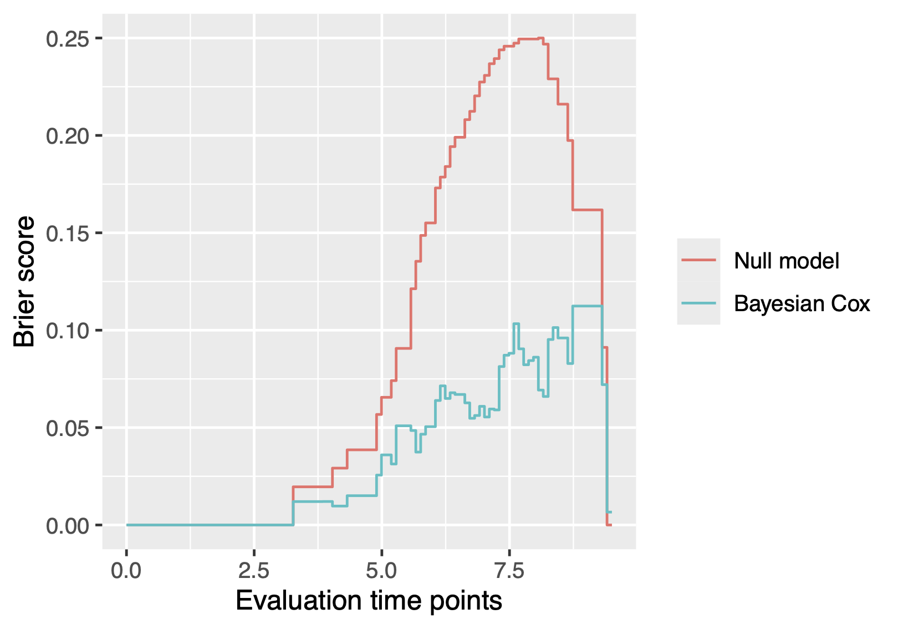

# BayesSurvive

[](https://cran.r-project.org/package=BayesSurvive)
[](https://ocbe-uio.r-universe.dev/BayesSurvive)
[](https://github.com/ocbe-uio/BayesSurvive/actions)
[](https://www.gnu.org/licenses/gpl-3.0)
[](https://doi.org/10.32614/CRAN.package.BayesSurvive)


This is a R/Rcpp package **BayesSurvive** for Bayesian survival models with graph-structured selection priors for sparse identification of high-dimensional features predictive of survival ([Madjar et al., 2021](https://bmcbioinformatics.biomedcentral.com/articles/10.1186/s12859-021-04483-z)) (see the three models of the first column in the table below) and its extensions with the use of a fixed graph via a Markov Random Field (MRF) prior for capturing known structure of high-dimensional features (see the three models of the second column in the table below), e.g. disease-specific pathways from the Kyoto Encyclopedia of Genes and Genomes (KEGG) database.

Model        | Infer `MRF_G` | Fix `MRF_G`
------------:| --------------|---------------
`Pooled`     |        ✔      |           ✔          
`CoxBVSSL`   |        ✔      |           ✔          
`Sub-struct` |        ✔      |           ✔          

## Installation

Install the latest released version from [CRAN](https://CRAN.R-project.org/package=BayesSurvive)

```r
install.packages("BayesSurvive")
```

Install the latest development version from [GitHub](https://github.com/ocbe-uio/BayesSurvive)

```r
#install.packages("remotes")
remotes::install_github("ocbe-uio/BayesSurvive")
```


## Examples

### Simulate data

```r
library("BayesSurvive")
# Load the example dataset
data("simData", package = "BayesSurvive")
dataset = list("X" = simData[[1]]$X, 
               "t" = simData[[1]]$time,
               "di" = simData[[1]]$status)
```

### Run a Bayesian Cox model

```r
## Initial value: null model without covariates
initial = list("gamma.ini" = rep(0, ncol(dataset$X)))
# Prior parameters
hyperparPooled = list(
  "c0"     = 2,                      # prior of baseline hazard
  "tau"    = 0.0375,                 # sd (spike) for coefficient prior
  "cb"     = 20,                     # sd (slab) for coefficient prior
  "pi.ga"  = 0.02,                   # prior variable selection probability for standard Cox models
  "a"      = -4,                     # hyperparameter in MRF prior
  "b"      = 0.1,                    # hyperparameter in MRF prior
  "G"      = simData$G               # hyperparameter in MRF prior
)   

## run Bayesian Cox with graph-structured priors
set.seed(123)
fit <- BayesSurvive(survObj = dataset, model.type = "Pooled", MRF.G = TRUE, 
                    hyperpar = hyperparPooled, initial = initial, 
                    nIter = 200, burnin = 100)

## show posterior mean of coefficients and 95% credible intervals
library("GGally")
plot(fit) + 
  coord_flip() + 
  theme(axis.text.x = element_text(angle = 90, size = 7))
```


Show the index of selected variables by controlling Bayesian false discovery rate (FDR) at the level $\alpha = 0.05$

```r
which( VS(fit, method = "FDR", threshold = 0.05) )
```
```
#[1]   1   2   3   4   5   6   7   8   9  10  11  12  13  14  15 194
```

### Plot time-dependent Brier scores

The function `BayesSurvive::plotBrier()` can show the time-dependent Brier scores based on posterior mean of coefficients or Bayesian model averaging.

```r
plotBrier(fit, survObj.new = dataset)
```



We can also use the function `BayesSurvive::predict()` to obtain the Brier score at time 8.5, the integrated Brier score (IBS) from time 0 to 8.5 and the index of prediction accuracy (IPA).

```r
predict(fit, survObj.new = dataset, times = 8.5)
```
```{ .text .no-copy }
##               Brier(t=8.5) IBS(t:0~8.5) IPA(t=8.5)
## Null.model      0.2290318   0.08185316  0.0000000
## Bayesian.Cox    0.1013692   0.02823275  0.5574011
```

### Predict survival probabilities and cumulative hazards

The function `BayesSurvive::predict()` can estimate the survival probabilities and cumulative hazards.

```r
predict(fit, survObj.new = dataset, type = c("cumhazard", "survival"))
```
```{ .text .no-copy }
#        observation times cumhazard  survival
##              <int> <num>     <num>     <num>
##     1:           1   3.3  7.41e-05  1.00e+00
##     2:           2   3.3  2.51e-01  7.78e-01
##     3:           3   3.3  9.97e-07  1.00e+00
##     4:           4   3.3  1.84e-03  9.98e-01
##     5:           5   3.3  3.15e-04  1.00e+00
##    ---                                      
##  9996:          96   9.5  7.15e+00  7.88e-04
##  9997:          97   9.5  3.92e+02 7.59e-171
##  9998:          98   9.5  2.81e+00  6.02e-02
##  9999:          99   9.5  3.12e+00  4.42e-02
## 10000:         100   9.5  1.97e+01  2.79e-09
```

### Run a 'Pooled' Bayesian Cox model with graphical learning

```r
hyperparPooled <- append(hyperparPooled, list("lambda" = 3, "nu0" = 0.05, "nu1" = 5))
fit2 <- BayesSurvive(survObj = list(dataset), model.type = "Pooled", MRF.G = FALSE,
                     hyperpar = hyperparPooled, initial = initial, nIter = 10)
```

### Run a Bayesian Cox model with subgroups using fixed graph 

```r
# specify a fixed joint graph between two subgroups
hyperparPooled$G <- Matrix::bdiag(simData$G, simData$G)
dataset2 <- simData[1:2]
dataset2 <- lapply(dataset2, setNames, c("X", "t", "di", "X.unsc", "trueB"))
fit3 <- BayesSurvive(survObj = dataset2, 
                     hyperpar = hyperparPooled, initial = initial, 
                     model.type="CoxBVSSL", MRF.G = TRUE, 
                     nIter = 10, burnin = 5)
```

### Run a Bayesian Cox model with subgroups using graphical learning

```r
fit4 <- BayesSurvive(survObj = dataset2, 
                     hyperpar = hyperparPooled, initial = initial, 
                     model.type="CoxBVSSL", MRF.G = FALSE, 
                     nIter = 3, burnin = 0)
```

## References

> Zhi Zhao, Katrin Madjar, Tobias Østmo Hermansen (2024).
> BayesSurvive: Bayesian Survival Models for High-Dimensional Data.
> _R package version 0.0.2_. DOI: [10.32614/CRAN.package.BayesSurvive](https://doi.org/10.32614/CRAN.package.BayesSurvive).

> Katrin Madjar, Manuela Zucknick, Katja Ickstadt, Jörg Rahnenführer (2021).
> Combining heterogeneous subgroups with graph‐structured variable selection priors for Cox regression.
> _BMC Bioinformatics_, 22(1):586. DOI: [10.1186/s12859-021-04483-z](https://bmcbioinformatics.biomedcentral.com/articles/10.1186/s12859-021-04483-z).
